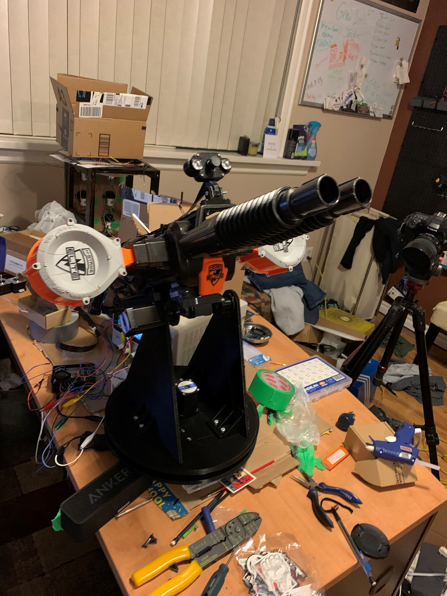
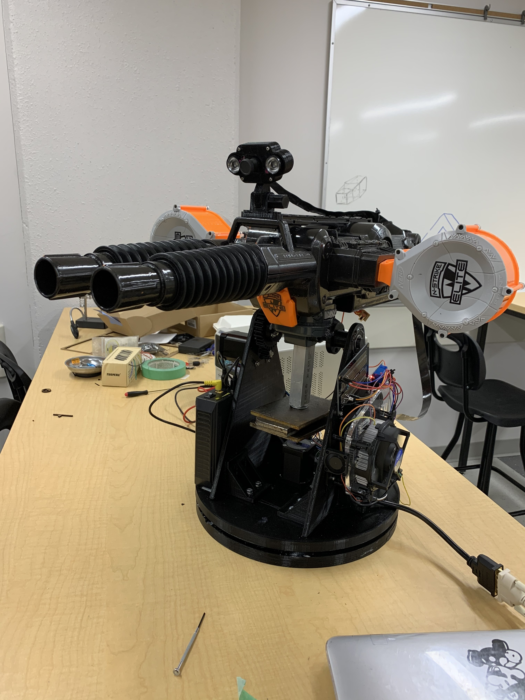

# 3D-Printed-AI-Nerf-Sentry-Turret
The first AI fully 3D printed chassis with OpenCV tracking

I am still in the process of making a youtube video and a proper hackster.io write up, stay posted for a full guide with my code posted here.


##Notes

- Use workon cv to enter virtual env

- Use command to active 
```python pan_tilt_tracking.py --cascade haarcascade_frontalface_default.xml```

[py images cv tut](https://www.pyimagesearch.com/2019/04/01/pan-tilt-face-tracking-with-a-raspberry-pi-and-opencv/)


## Photo Gallery
<details>
  <summary>Click for more Photos</summary>
  



</details>